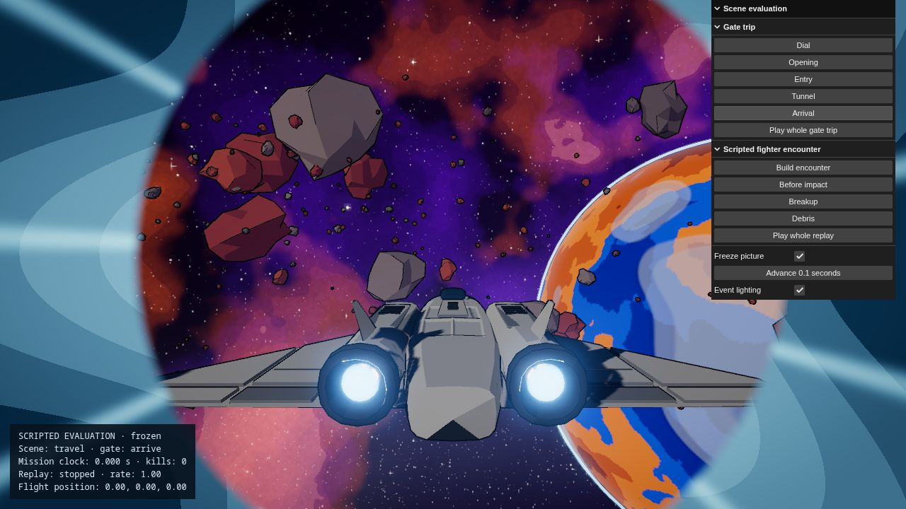
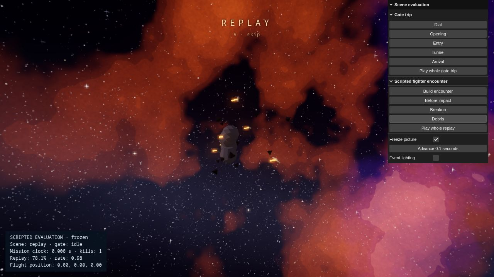
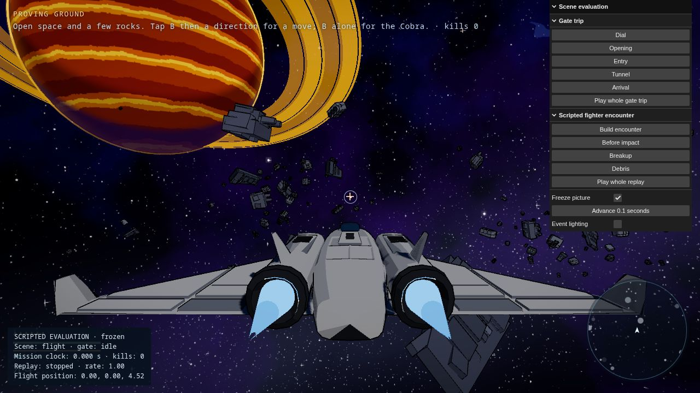
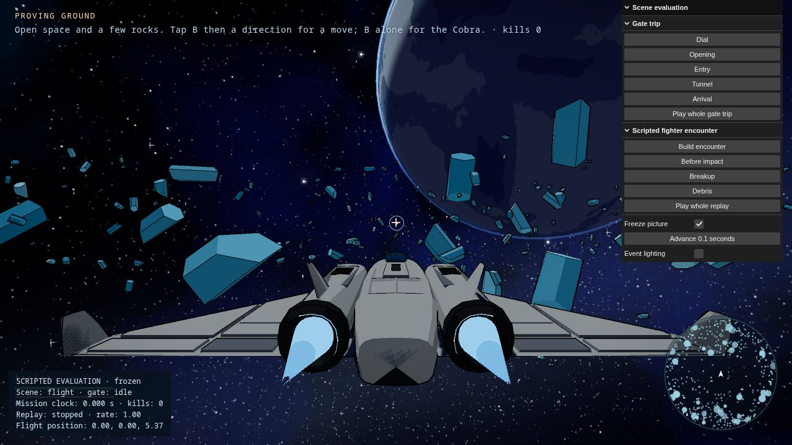

# Graphics scenes · 2026-09-08

Implemented Ethan’s five-part graphics request plus optional event lighting. The existing selected procedural fleet remains active.

## Verification

- `npm run build`: pass. Existing large-chunk warning remains; current main bundle 841.11 kB minified (238.94 kB gzip). No performance improvement is claimed from this.
- `node scripts/audio-scene-check.mjs`: bus isolation, scheduled-tail cancellation, replay rates, pause/resume, pre-unlock scene and mute callback pass. This is a mocked WebAudio routing check, not acoustic evaluation.
- `node scripts/destruction-check.mjs`: deterministic ship/rock/impact reconstruction, different seeds, repeated clearing, playback clock, bounded pools and expiry pass.
- `node scripts/environment-check.mjs`: all three field styles generate and destruct successfully; ice geometry matches its convex collision planes.
- `node scripts/replay-clock-check.mjs`: kill/death alignment, equal-time seeded FX across playback steps, exhaust clock, stop pose/FOV/visibility restoration and preservation of live FX pass.
- In-app browser at 1280×720: inspected opening, tunnel, arrival, full gate trip returning to flight, scripted fighter breakup/debris, ice/wreck fields, side/rear views, optional lighting toggle and persistence. Full-trip browser warning/error log was empty. Review freeze/step holds flight while travel presents; recorded fixture reports one kill and zero mission time. These are scripted observations, not mission completion evidence.

The browser controller used for this session permits its own UI APIs rather than direct Playwright/CDP scripting. Legacy `travel-test.mjs`, `chain-test.mjs`, `rock-test.mjs` and `hatak-probe.mjs` were not rerun. Focused CPU checks and UI scene checks above are the verification performed; they do not establish full campaign regression coverage. Human flight feel, listening quality and sustained target-hardware performance remain unmeasured. Capital/escort rigs remain frozen during replay rather than carrying full pose history.

## Try it

Run `npm run dev -- --port 5198` (the normal configured port was occupied by Forge Shell during this session). Open `/?review=1&mission=proving-ground&lock=free`. The labelled evaluation panel offers gate stages, a complete gate trip, a real combat collision on a predetermined fighter path, replay stages and whole playback. Freeze/advance controls support visual comparison. The fixture does not award mission progress. The normal Escape settings menu also includes Event lighting, saved off by default.

## Captures

Side/rear regression captures: `../shots/2026-09-08-side.png` and `../shots/2026-09-08-rear.png`.

## Remaining direction

This pass is ready for owner evaluation of the gate timing, destruction framing, cloud style and optional lighting. No switch to Blender, new fleet redesign or deployment was included. Acoustic quality and full campaign regression checks are not closed by this evidence.
