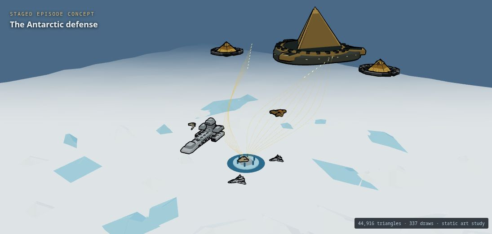

# SG-1 episode graphics · September 11, 2026

Open the development server at `/episode-fleet.html`. The gallery starts with Antarctica. Episodes show the proposed level moment and its source; Ships gives perspective, top, side, front and rear views, free orbit, silhouette and rotation.

This is the graphics pass Ethan requested before discussing level order and implementation. All pictures below are actual renders of the authored Three.js assets. Ship sizes and scene placements are compressed for review; they are not canon measurements, episode screenshots or playable missions.

## Antarctica

Prometheus covers the cargo ship at the drilling site; F-302s cross the ice beneath Anubis’s fleet. Gold paths suggest the Ancient drone salvo. The polar terrain, excavation and placements are stylized scene construction. Drones are static paths here, not a completed battle animation.

## Nine new ships

The six existing fleet assets in the gallery provide scale and context and keep their current gameplay definitions. The following nine are new. The two Anubis ships and the two Asgard classes are separate models.

| Ship | Perspective | Top | Side | Rear |
|---|---|---|---|---|
| BC-304 | [perspective](../shots/episode-fleet/carrier-perspective.png) | [top](../shots/episode-fleet/carrier-top.png) | [side](../shots/episode-fleet/carrier-side.png) | [rear](../shots/episode-fleet/carrier-rear.png) |
| Tel’tak | [perspective](../shots/episode-fleet/cargo-perspective.png) | [top](../shots/episode-fleet/cargo-top.png) | [side](../shots/episode-fleet/cargo-side.png) | [rear](../shots/episode-fleet/cargo-rear.png) |
| Asgard O’Neill class | [perspective](../shots/episode-fleet/hammer-perspective.png) | [top](../shots/episode-fleet/hammer-top.png) | [side](../shots/episode-fleet/hammer-side.png) | [rear](../shots/episode-fleet/hammer-rear.png) |
| Daniel Jackson class | [perspective](../shots/episode-fleet/science-perspective.png) | [top](../shots/episode-fleet/science-top.png) | [side](../shots/episode-fleet/science-side.png) | [rear](../shots/episode-fleet/science-rear.png) |
| Ori warship | [perspective](../shots/episode-fleet/ring-perspective.png) | [top](../shots/episode-fleet/ring-top.png) | [side](../shots/episode-fleet/ring-side.png) | [rear](../shots/episode-fleet/ring-rear.png) |
| Anubis’s Lost City flagship | [perspective](../shots/episode-fleet/flagship-perspective.png) | [top](../shots/episode-fleet/flagship-top.png) | [side](../shots/episode-fleet/flagship-side.png) | [rear](../shots/episode-fleet/flagship-rear.png) |
| Anubis’s Fallen superweapon ship | [perspective](../shots/episode-fleet/superweapon-perspective.png) | [top](../shots/episode-fleet/superweapon-top.png) | [side](../shots/episode-fleet/superweapon-side.png) | [rear](../shots/episode-fleet/superweapon-rear.png) |
| Seberus | [perspective](../shots/episode-fleet/civilian-perspective.png) | [top](../shots/episode-fleet/civilian-top.png) | [side](../shots/episode-fleet/civilian-side.png) | [rear](../shots/episode-fleet/civilian-rear.png) |
| Replicator craft study | [perspective](../shots/episode-fleet/machine-perspective.png) | [top](../shots/episode-fleet/machine-top.png) | [side](../shots/episode-fleet/machine-side.png) | [rear](../shots/episode-fleet/machine-rear.png) |

The Replicator hull explores machine construction; its exact screen silhouette remains unverified. Anubis’s flagship uses the Lost City pyramid form, not the circular ship from Fallen. The O’Neill decoy and Thor’s Daniel Jackson science vessel retain different silhouettes. Seberus is a new civilian craft rather than a renamed existing racer.

## Twelve level ideas, with no campaign order assigned

### The Antarctic defense · Lost City, Part 2 · S7 E22

Escort the cargo ship to the drilling site, peel attackers off Prometheus, then hold the airspace long enough for the drone salvo. The choice later is whether this is one long mission or several connected sorties.

[Rendered scene](../shots/episode-fleet/scene-antarctica.png) · [Episode reference](https://rdanderson.com/stargate/episodes/episodes/07-21lost.htm)

### The fragments still matter · New Order · S8 E1–2

Intercept surviving machine fragments above Orilla. This could turn the usual victory explosion into the start of a second visual beat. Decide later whether we preserve the episode outcome or mark the sortie as an alternate scenario.

[Rendered scene](../shots/episode-fleet/scene-new-order.png) · [Episode reference](https://www.rdanderson.com/stargate/episodes/episodes/08-01neworder.htm)

### The Loop of Kon Garat · Space Race · S7 E8

A race with a rescue choice: leave the ideal line to help a sabotaged competitor, then fight back through the field. Seberus gives this a different mood from military sorties.

[Rendered scene](../shots/episode-fleet/scene-space-race.png) · [Episode reference](https://www.rdanderson.com/stargate/episodes/episodes/07-08spacerace.htm)

### The Supergate opens · Camelot · S9 E20

Begin with a formation approach and reconnaissance around the gate; shift to protecting evacuation routes when the Ori ships arrive. Survival and rescue could make a more faithful objective than destroying the whole enemy fleet.

[Rendered scene](../shots/episode-fleet/scene-camelot.png) · [Episode reference](https://rdanderson.com/stargate/episodes/episodes/09-20camelot.htm)

### The last gift · Unending · S10 E20

A departure-and-pursuit concept: get clear of the planet, screen Odyssey’s departure and escape converging fire. Keep the time-dilation device as a possible visual transition until we discuss how it should play.

[Rendered scene](../shots/episode-fleet/scene-unending.png) · [Episode reference](https://rdanderson.com/stargate/episodes/episodes/10-20unending.htm)

### Under the shield · Fallen · S7 E1

A precision pass along Anubis’s hull toward the superweapon’s vulnerable cooling vent. A route that rewards the new powered stunts could be interesting, provided the camera keeps the route readable.

[Rendered scene](../shots/episode-fleet/scene-fallen.png) · [Episode reference](https://rdanderson.com/stargate/episodes/episodes/07-01fallen.htm)

### The unfinished decoy · Small Victories · S4 E1

Draw pursuing Replicator-controlled ships onto the decoy’s route and escape before detonation. Tension can come from managing distance rather than an oversized health bar.

[Rendered scene](../shots/episode-fleet/scene-small-victories.png) · [Episode reference](https://rdanderson.com/stargate/episodes/episodes/04-01victories.htm)

### Beyond the rescue window · Tangent · S4 E12

A navigation-and-rendezvous mission: conserve thrust, reach a narrow interception corridor and match velocity with the rescue craft. This could be a quiet break from combat.

[Rendered scene](../shots/episode-fleet/scene-tangent.png) · [Episode reference](https://rdanderson.com/stargate/episodes/episodes/04-12tangent.htm)

### Outrun the star · Exodus · S4 E22

Cover the captured Ha’tak, intercept the Al’kesh and reach the escape corridor as the star destabilizes. An expanding light front and navigation pressure would give us a different finale from a capital-ship kill.

[Rendered scene](../shots/episode-fleet/scene-exodus.png) · [Episode reference](https://rdanderson.com/stargate/episodes/episodes/04-22exodus.htm)

### A ship that is no longer ours · Enemies · S5 E1

Protect the escape craft while parts of the mothership go dark, then leave before the sabotaged mothership crashes. We can emphasize rescue and timed departure rather than turn every Replicator story into dogfighting.

[Rendered scene](../shots/episode-fleet/scene-enemies.png) · [Episode reference](https://rdanderson.com/stargate/episodes/episodes/05-01enemies.htm)

### The asteroid that will not break · Fail Safe · S5 E17

A close survey through fragments, then a precision delivery or extraction at the asteroid. Save the hyperspace solution for the finale rather than making the rock another target to grind down.

[Rendered scene](../shots/episode-fleet/scene-fail-safe.png) · [Episode reference](https://rdanderson.com/stargate/episodes/episodes/05-17failsafe.htm)

### Hold above Dakara · Reckoning · S8 E16–17

Keep an escape corridor open while rival fleets converge. A changing ally/enemy map could matter more than simply adding more waves.

[Rendered scene](../shots/episode-fleet/scene-reckoning.png) · [Episode reference](https://rdanderson.com/stargate/episodes/episodes/08-16reckoning.htm)

## What was checked

- `npm run build`: passed, including TypeScript and both production entry pages. Existing Three.js chunk-size warning remains; shared chunk is about 610 kB minified.
- `node scripts/episode-fleet-check.mjs`: passed against the actual geometry factories. All new hulls/props have finite geometry and transforms; machine instances are deterministic; Supergate has an open center and solid rim geometry. This does not certify future gameplay collision behavior.
- In-app browser: all nine new hulls rendered in perspective/top/side/rear views (36 captures), and all twelve episode scenes rendered (12 captures). [Hull observations](../shots/episode-fleet/hull-observations.json) and [scene observations](../shots/episode-fleet/scene-observations.json) record DOM titles, view rectangles and renderer counts from those captures. Paths were normalized to repository-relative form afterward.
- Built production gallery loaded Antarctica with 44,916 triangles / 337 draws and no browser errors.
- Normal game entry loaded its flight scene and control menu without browser errors.
- Actual silhouette toggle, model rotation, camera reset, source-linked navigation and feedback persistence through reload were exercised. The temporary QA feedback was cleared. An initial ResizeObserver loop was fixed by scheduling resize on the next frame and updating dimensions only when changed; final browser error logs were empty.
- Export buttons are implemented but a browser download event did not arrive in the in-app browser; download completion is unverified. The temporary narrow viewport request did not change the reported 1360-pixel viewport, so no successful mobile verification is claimed. The override was reset.

Renderer counts are static scene observations, not frame-rate measurements. Antarctica currently uses hundreds of draw calls as an art composition; it needs a budgeted gameplay integration pass. Target laptop performance, physical input feel, battle animation, mission pacing and owner likeness acceptance have not been tested by this art pass.

## Durable state and deferred work

**Shipped, closed:** graphics factories, separate review entry, source notes and 48 render captures. The main game ship registry and campaign were not changed. No deployment was performed.

**Named, not built:** order, objective design, playable missions, scripted battle events, collisions, scale and balance. Ethan explicitly deferred this discussion.

**Found, unresolved:** exact Replicator likeness; Dakara ground installation; the decoy’s pursuing Asgard ships; mission-scale VFX; export completion and narrow-browser verification. These are visible limitations, not a request for approval to continue after the one-hour window.

Source research: [episode and fleet notes](../refs/episode-fleet-2026-09-11.md). Fact references and interpretive scene choices are kept separate in the gallery.

To resume locally: `npm run dev -- --host 127.0.0.1 --port 5203`, then open `/episode-fleet.html`. The gallery is also included by the Vite production build.
